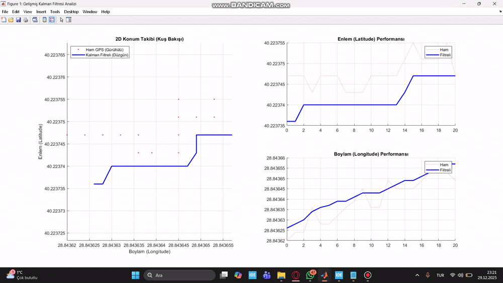

# STM32 GPS Tracker with Kalman Filter 🛰️

Bu çalışma, **Bursa Uludağ Üniversitesi Elektrik-Elektronik Mühendisliği Bölümü**, **Tasarım 1 ve Proje Hazırlık** dersleri kapsamında, gömülü sistemler ve istatistiksel sinyal işleme tekniklerini gerçek hayat problemlerine uygulamak amacıyla geliştirilmiştir.

This project implements a real-time GPS tracking system using an **STM32F401** microcontroller. It utilizes a **Discrete Kalman Filter** algorithm to eliminate sensor noise and estimate the precise position and velocity of the device. The data is visualized on a custom-built **MATLAB Mission Control Dashboard**.

## 🚀 Features
* **Embedded System:** STM32 C implementation with HAL libraries.
* **Signal Processing:** Custom 2x2 Kalman Filter (State: Position & Velocity).
* **Data Parsing:** NMEA sentence parsing from NEO-6M GPS module.
* **Ground Station:** Advanced MATLAB GUI with Real-time Mapping, Speedometer, and Error Analysis.

## 📐 Mathematical Background (Kalman Filter Model)
The core of this project is the estimation of the state vector $x = [position, velocity]^T$.

**1. State Prediction:**
$$\hat{x}_{k|k-1} = F \hat{x}_{k-1|k-1} + B u_k$$
$$P_{k|k-1} = F P_{k-1|k-1} F^T + Q$$

**2. Measurement Update:**
$$K_k = P_{k|k-1} H^T (H P_{k|k-1} H^T + R)^{-1}$$
$$\hat{x}_{k|k} = \hat{x}_{k|k-1} + K_k (z_k - H \hat{x}_{k|k-1})$$
$$P_{k|k} = (I - K_k H) P_{k|k-1}$$

## 🛠️ Hardware Used
* **Microcontroller:** STM32F401CCU6 (Black Pill)
* **GPS Module:** u-blox NEO-6M
* **Communication:** USB-TTL Converter (UART)
* **Debugger:** ST-Link V2

## 📊 Project Demo & Dashboard

## 📉 Kalman Filter Performance
The system successfully smooths out GPS jitter.
* **Red Points:** Raw Noisy Data
* **Blue Line:** Filtered Path (Kalman)

## 💻 How to Run
1.  Flash the `main.c` and `kalman.c` to the STM32 board.
2.  Connect the hardware (GPS TX -> PA3, TTL RX -> PA9).
3.  Run the `gps_mission_control.m` script in MATLAB.
4.  Press the Reset button on STM32 to start the data stream.

---
*Developed by Mehmet Ali YÜCEL*
